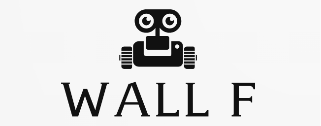
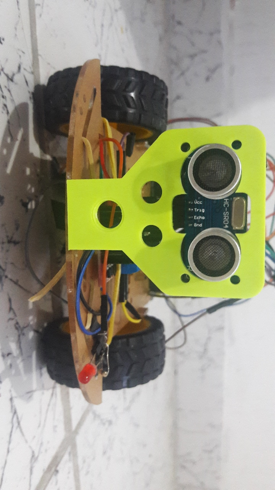

  

<h2 align="center">Robô que Desvia de Obstáculos 🤖</h2>

### Descrição do Projeto
O projeto "WALL F" consiste na construção de um robô capaz de desviar de obstáculos de forma controlada. Ao detectar obstáculos, o robô ajusta a velocidade do piscar dos LEDs 💡 e exibe mensagens no display do PICGenios de acordo com a distância do obstáculo.

### Plataformas Utilizadas
1. **Arduino Mega 2560:** A primeira plataforma escolhida para o projeto, o Arduino Mega 2560, oferece ampla flexibilidade e suporte para diversos periféricos. Utilizamos recursos como PWM, GPIO e comunicação serial para garantir um controle eficiente do robô.

2. **Kit PICGenios:** A segunda plataforma adotada foi o Kit PICGenios, que proporciona recursos avançados, incluindo GPIO, PWM e um conversor analógico-digital (AD). Essa combinação permite uma abordagem mais robusta e versátil na implementação do projeto.

### Modo de Comunicação
A comunicação entre as duas plataformas é realizada por meio da interface USART/UART. Essa escolha visa garantir uma transmissão de dados eficiente e confiável, permitindo uma integração suave entre o Arduino Mega 2560 e o Kit PICGenios.

### Recursos Utilizados
#### Plataforma Arduino Mega 2560:
- PWM (Modulação por Largura de Pulso)
- GPIO (Entrada/Saída de Propósito Geral)
- Comunicação Serial

#### Plataforma Kit PICGenios:
- GPIO (Entrada/Saída de Propósito Geral)
- PWM (Modulação por Largura de Pulso)
- Conversor Analógico-Digital (AD)
- Display LCD

#### Periféricos Utilizados
##### No Arduino:
- LEDs 💡
- Sensor Ultrassônico
- Joystick

##### No Kit PICGenios:
- LEDs 💡
- Ventoinha
- Display LCD

## Funcionalidades Adicionais
- Ao detectar obstáculos, a velocidade do piscar dos LEDs ajusta-se de forma proporcional à distância do obstáculo.
- Mensagens exibidas no display do PICGenios variam de acordo com a distância do obstáculo.

## Mídia 

  
  &nbsp;&nbsp;&nbsp;&nbsp;&nbsp;
  

